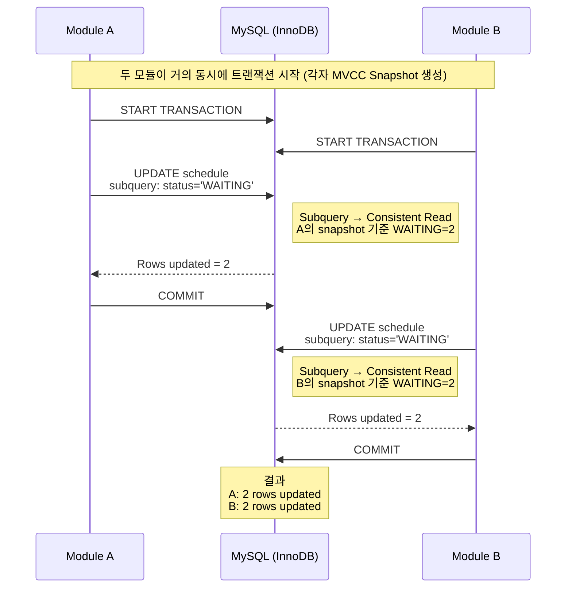

특정 발송 스케줄을 DB 상 선점하여 발송하는 부분에서 이슈가 발생했다.

일부 발송건이 두 모듈에 의해 중복으로 처리되어 중복발송 처리가 된 것이다.


장애의 원인은 MySQL 에서 Current 모드와 Consistent 모드 읽기 차이로 인해 발생했다.


### 어떻게 발생하게 되었는가?

schedule 테이블엔 데이터가 **2건**이 있으며, 두 발송 모듈이 위의 쿼리를 동시에 수행한다고 해보자.

```sql
UPDATE 
	schedule s
SET 
	poll_key = #{module_id}, 
	status = 'RUNNING'
WHERE s.id IN (
    SELECT id
    FROM (
        SELECT id
        FROM schedule
        WHERE status = 'WAITING'
    ) tmp
);
```

> 쿼리는 간소한 형식으로 표현했으며, 실제 운영 쿼리에서는 IN 절 내 서브쿼리에 여러 테이블을 조인하여 필터링 하는 조건이 포함되어 있다.


흐름이 정리 된 아래 다이어그램을 살펴보자.





위에 다이어그램을 보면 이상한 점이 존재한다.

Module A 가 업데이트 쿼리를 통해 먼저 선점을 해갔으나, 이후 수행한 Module B도 동일한 데이터에 업데이트를 수행했다.


일반적으로 생각한다면 아래와 같아야 한다.

- Module A 가 업데이트 쿼리를 통한 2건 선점
- Module B 는 A 가 업데이트 쿼리 수행 시 결과 없음


하지만 실제로는 두 모듈이 동일하게 2개의 Row 를 업데이트 치게 된다.

이 현상의 원인은 MySQL 에서 Current 모드와 Consistent 모드의 읽기 방식 차이로 인해 발생한다.


#### Consistent Read

InnoDB 에서 일반적인 SELECT 는 Consistent Read 방식으로 동작한다.


Consistent Read 의 경우 아래와 같은 특징을 가진다.

- 트랜잭션 시작 시점의 스냅샷을 기준으로 데이터를 읽는다.
- Undo log 를 이용하여 과거 버전의 데이터를 이용한다.
- 다른 트랜잭션이 수정 중인 데이터에 대해 락을 기다리지 않는다.


예를 들어, 아래와 같은 쿼리는 Consistent Read 방식으로 동작한다.

```sql
select * from schedule where status = 'WAITING';
```


#### Current Read

반면 아래와 같은 케이스의 경우에는 Current Read 를 수행한다.

- UPDATE, DELETE, SELECT ... FOR UPDATE


Current Read 의 경우 아래와 같은 특징을 가진다.

- 현재 최신 버전의 데이터를 기준으로 읽으며 필요한 경우 row lock을 획득한다.


예를 들어, 아래와 같은 쿼리는 Current Read 방식으로 동작한다.

```sql
-- Case 1(FOR UPDATE)
SELECT 
	* 
FROM 
	schedule 
WHERE status = 'WAITING' 
FOR UPDATE;

-- Case 2(UPDATE)
UPDATE 
	schedule s 
set 
	status = 'ACTIVE' 
where 
	status = 'WAITING'
```


#### 그러면 위의 케이스는 어떻게 된 것인가?

위의 쿼리를 다시 한번 보면 아래와 같다.

```sql
UPDATE 
	schedule s
SET 
	poll_key = #{module_id}, 
	status = 'RUNNING'
WHERE s.id IN (
    SELECT id
    FROM (
        SELECT id
        FROM schedule
        WHERE status = 'WAITING'
    ) tmp
);
```


이 쿼리에는 두 가지의 읽기 방식이 존재하게 된다.

- WHERE 조건의 서브쿼리 SELECT => Consistent Read
- 실제 UPDATE 대상 row 접근 => Current Read


실행 흐름으로 보자면,

1) WHERE 조건에서 서브쿼리의 결과 집합이 Consistent Read 기준으로 추출된다.
2) 추출된 결과 집합을 기준으로 UPDATE 를 수행해 동일한 row 들이 업데이트 된다.


### 그러면 어떻게 막아야 하는가?

#### Current 모드로 업데이트 수행

단순히 위의 쿼리를 수정한다면 아래와 같이 조건절에 값 하나를 추가해줄 수 있다.

실제로 해당 운영 환경에서는 아래와 같이 조치를 수행했다.

```sql
UPDATE 
	schedule s
SET 
	poll_key = 'MODULE-02', 
	status = 'RUNNING'
WHERE s.id IN (
    SELECT id
    FROM (
        SELECT id
        FROM schedule
        WHERE status = 'WAITING'
    ) tmp
) and s.status = 'WAITING'; -- status 조건을 UPDATE 조건절에 추가해 Current 모드로 읽도록 추가
```


이 조건을 추가하면 UPDATE 단계에서 status 값을 다시 한 번 검증하게 된다.

UPDATE는 Current Read로 실행되기 때문에 다른 트랜잭션이 먼저 status 값을 변경했다면 두 번째 트랜잭션은 해당 row를 UPDATE 대상으로 선택하지 않게 된다.


즉, 서브쿼리 단계에서는 Consistent Read 로 대상이 계산되지만 UPDATE 시에는 Current Read 기준으로 다시 조건이 검증되기 때문에 

이미 다른 트랜잭션이 처리한 row는 UPDATE 대상에서 제외된다.


